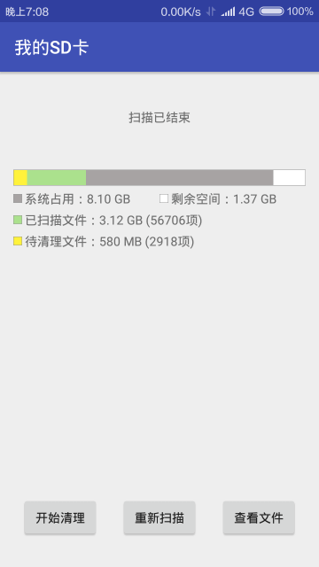
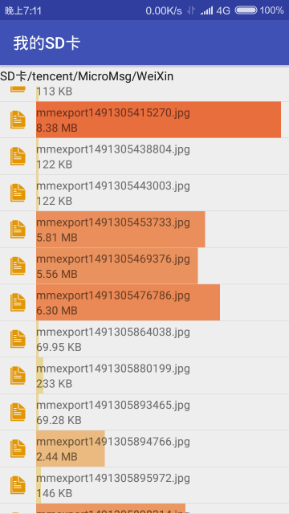

# SDCardCleaner

Android手机SD卡清理工具

### 简介

现在各种各样的APP均能在用户的SD卡上创建文件夹及文件，而且所占用的空间没有限制，这就导致用户SD卡的空间非常紧张，并且SD卡目录中的文件非常混乱。
本软件的宗旨是SD卡是用户的，用户有权利删除SD卡上的一切数据，正常的APP都不应该将必要数据文件存放在SD卡中（一般都是用来存储缓存数据），如果用户清除SD卡中的内容，APP应该依然能够正常使用。
本软件就是为了方便用户清理SD卡中的内容，用户可以指定需要清理的目录，一次性将各种各样的文件统统删除。

### 主要功能

+ 统计存储目录中的文件数量及大小
+ 以直观的方式展示不同文件夹的空间占比
+ 一键删除标记过的垃圾文件

### 需求

* Android 6.0 及以上版本
* 查看/修改SD卡内容的权限

### 软件截图

&nbsp;

### 警告
使用本程序删除的文件均由用户指定，一切删除后果均由用户承担。